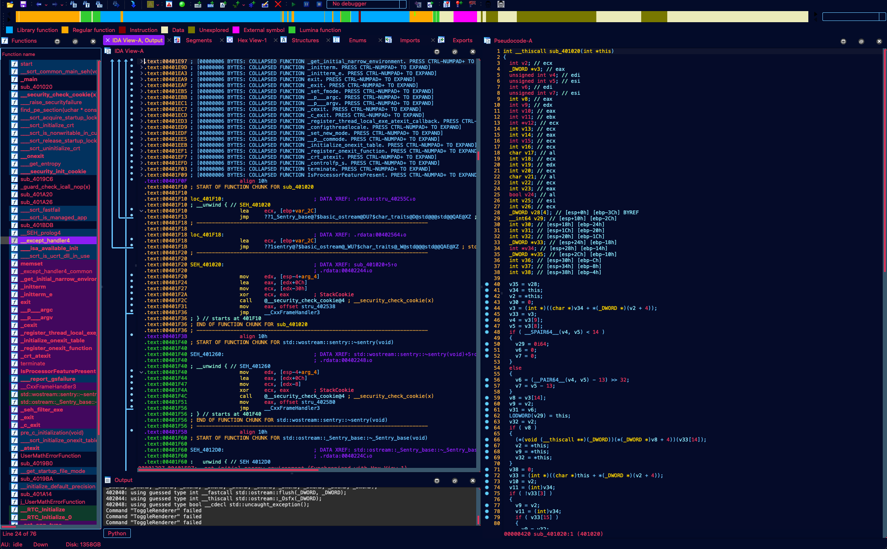

# IDA Pro Custom Theme

Painfully cribbed from full [IDA darcula theme](https://draculatheme.com/ida)

Place in your `IDA_USER/themes/jags_theme` directory, then select from the Options -> Colors drop down menu.
Fixes, improvements, etc, welcome. :)

### Things I haven't figured out how to fix (help very much welcome!)
- Buggy graph background colors
- Can't fix hover over drag menu
- Can't change color of console
	|_ This may be an IDA 8.2 error (the color resets when applied).
- Can't change caller of navbar or it breaks the whole thing
- Consistent background for the top bar
